ds2 hw2
================
Ruihan Zhang
2023-03-08

``` r
library(caret)
```

    ## Loading required package: ggplot2

    ## Loading required package: lattice

``` r
library(glmnet)
```

    ## Loading required package: Matrix

    ## Loaded glmnet 4.1-4

``` r
library(mlbench)
library(splines)
library(mgcv)
```

    ## Loading required package: nlme

    ## This is mgcv 1.8-40. For overview type 'help("mgcv-package")'.

``` r
library(pROC)
```

    ## Type 'citation("pROC")' for a citation.

    ## 
    ## Attaching package: 'pROC'

    ## The following objects are masked from 'package:stats':
    ## 
    ##     cov, smooth, var

``` r
library(earth)
```

    ## Loading required package: Formula

    ## Loading required package: plotmo

    ## Loading required package: plotrix

    ## Loading required package: TeachingDemos

``` r
library(tidyverse)
```

    ## ── Attaching packages
    ## ───────────────────────────────────────
    ## tidyverse 1.3.2 ──

    ## ✔ tibble  3.1.8      ✔ dplyr   1.0.10
    ## ✔ tidyr   1.3.0      ✔ stringr 1.5.0 
    ## ✔ readr   2.1.2      ✔ forcats 0.5.2 
    ## ✔ purrr   1.0.1      
    ## ── Conflicts ────────────────────────────────────────── tidyverse_conflicts() ──
    ## ✖ dplyr::collapse() masks nlme::collapse()
    ## ✖ tidyr::expand()   masks Matrix::expand()
    ## ✖ dplyr::filter()   masks stats::filter()
    ## ✖ dplyr::lag()      masks stats::lag()
    ## ✖ purrr::lift()     masks caret::lift()
    ## ✖ tidyr::pack()     masks Matrix::pack()
    ## ✖ tidyr::unpack()   masks Matrix::unpack()

``` r
library(ggplot2)
library(pdp)
```

    ## 
    ## Attaching package: 'pdp'
    ## 
    ## The following object is masked from 'package:purrr':
    ## 
    ##     partial

``` r
library(vip)
```

    ## 
    ## Attaching package: 'vip'
    ## 
    ## The following object is masked from 'package:utils':
    ## 
    ##     vi

``` r
library(AppliedPredictiveModeling)
```

``` r
college_data = read_csv("./College.csv")[-1] %>% 
  janitor::clean_names() %>% 
  na.omit()
```

    ## Rows: 565 Columns: 18
    ## ── Column specification ────────────────────────────────────────────────────────
    ## Delimiter: ","
    ## chr  (1): College
    ## dbl (17): Apps, Accept, Enroll, Top10perc, Top25perc, F.Undergrad, P.Undergr...
    ## 
    ## ℹ Use `spec()` to retrieve the full column specification for this data.
    ## ℹ Specify the column types or set `show_col_types = FALSE` to quiet this message.

``` r
set.seed(2023)
train_index=createDataPartition(y=college_data$outstate, p=0.8, list = FALSE)
college_train=college_data[train_index,]
college_test=college_data[-train_index,]
x =  college_train %>% dplyr::select(-outstate)
y = college_train$outstate
```

``` r
#1.
fit.ss1=smooth.spline(college_train$perc_alumni,college_train$outstate,lambda=0.03,cv=FALSE)
fit.ss1$df
```

    ## [1] 4.581636

``` r
perc_alumni.grid = seq(from=min(unique(college_train$perc_alumni))-10, to = max(unique(college_train$perc_alumni))+10, by=1)
pred.ss1=predict(fit.ss1,x=perc_alumni.grid)
pred.ss.df1=data_frame(pred=pred.ss1$y,perc_alumni=perc_alumni.grid)
```

    ## Warning: `data_frame()` was deprecated in tibble 1.1.0.
    ## ℹ Please use `tibble()` instead.

``` r
p1=ggplot(data=college_train,aes(x=perc_alumni, y=outstate))+geom_point(color=rgb(0.2, 0.4, 0.2, 0.5))
p1+geom_line(aes(x=perc_alumni.grid, y=pred),data=pred.ss.df1,color=rgb(0.8,0.1,0.1,1))+theme_bw()
```

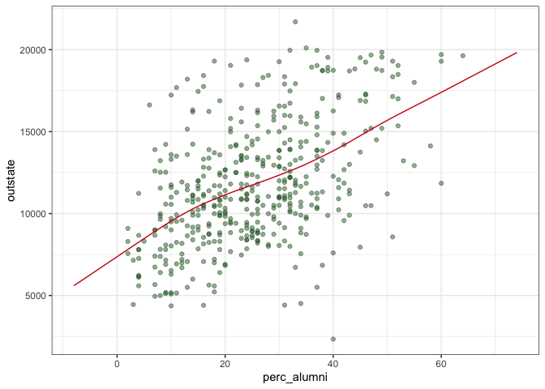<!-- -->

``` r
#When lambda is 0.03, the degree of freedom of the above smoothing spline model is 4.581636.
```

``` r
fit.ss2=smooth.spline(college_train$perc_alumni,college_train$outstate,cv=TRUE)
```

    ## Warning in smooth.spline(college_train$perc_alumni, college_train$outstate, :
    ## cross-validation with non-unique 'x' values seems doubtful

``` r
fit.ss2$df
```

    ## [1] 2.00025

``` r
fit.ss2$lambda
```

    ## [1] 2310.394

``` r
pred.ss2=predict(fit.ss2,x=perc_alumni.grid)
pred.ss.df2=data_frame(pred=pred.ss2$y,perc_alumni=perc_alumni.grid)
p2=ggplot(data=college_train,aes(x=perc_alumni, y=outstate))+geom_point(color=rgb(0.2, 0.4, 0.2, 0.5))
p2+geom_line(aes(x=perc_alumni.grid, y=pred),data=pred.ss.df2,color=rgb(0.8,0.1,0.1,1))+theme_bw()
```

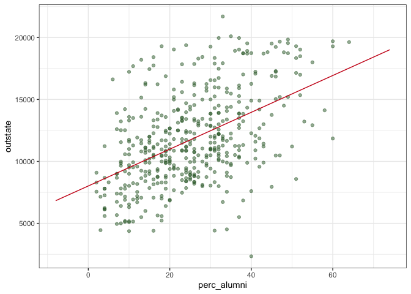<!-- -->

``` r
#By using cross-validation, the lambda is 2310.394, the degree of freedom of the above smoothing spline model is 2.00025.
```

``` r
#2.
gam.m=gam(outstate ~ apps+accept+enroll+s(top10perc)+top25perc+s(f_undergrad)+p_undergrad+s(room_board)+s(books)+personal+s(ph_d)+terminal+s(s_f_ratio)+perc_alumni+s(expend)+s(grad_rate), data = college_train)
plot(gam.m)
```

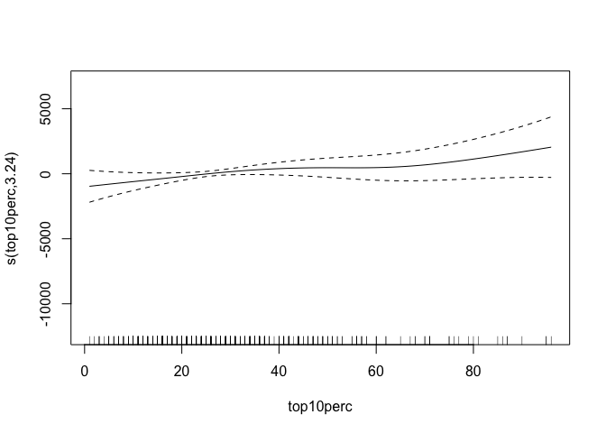<!-- -->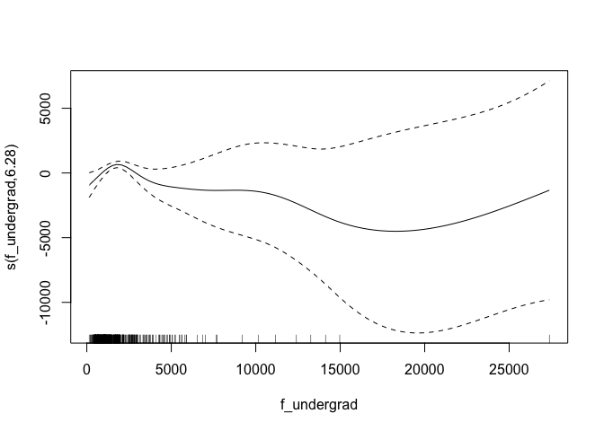<!-- -->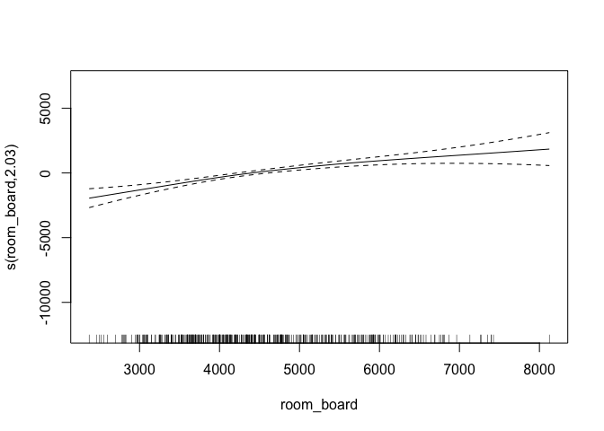<!-- -->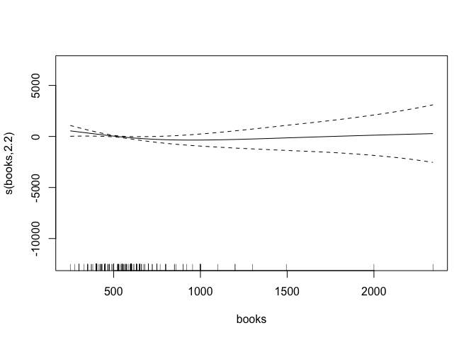<!-- -->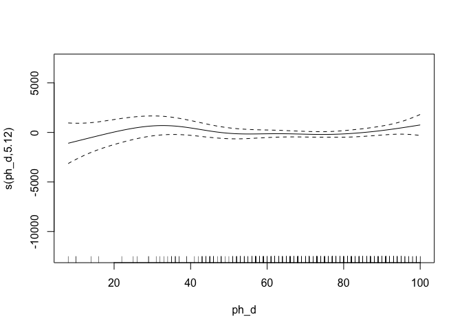<!-- -->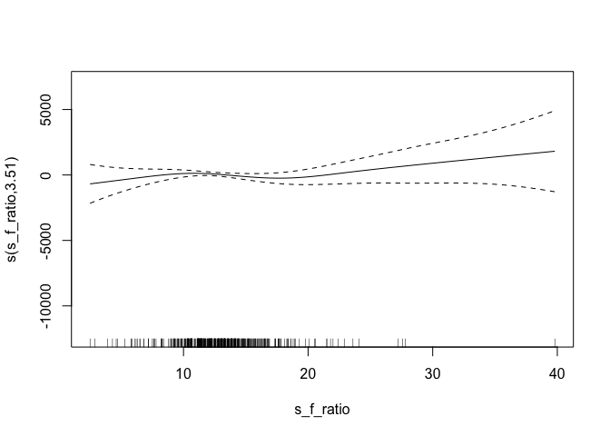<!-- -->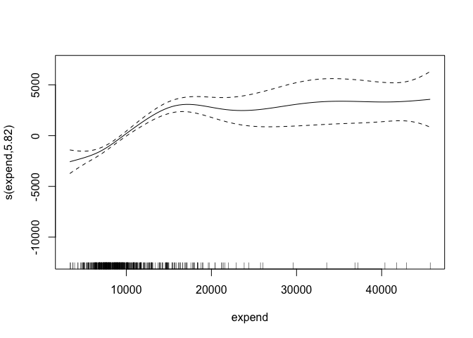<!-- -->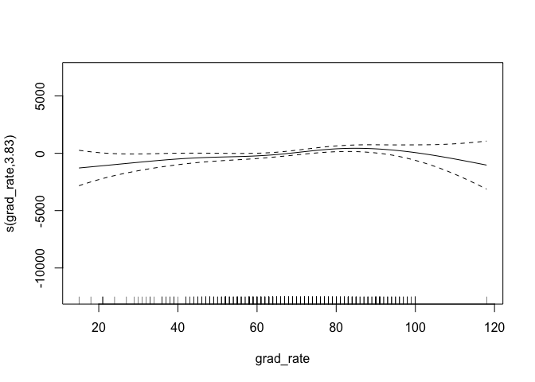<!-- -->

``` r
summary(gam.m)
```

    ## 
    ## Family: gaussian 
    ## Link function: identity 
    ## 
    ## Formula:
    ## outstate ~ apps + accept + enroll + s(top10perc) + top25perc + 
    ##     s(f_undergrad) + p_undergrad + s(room_board) + s(books) + 
    ##     personal + s(ph_d) + terminal + s(s_f_ratio) + perc_alumni + 
    ##     s(expend) + s(grad_rate)
    ## 
    ## Parametric coefficients:
    ##               Estimate Std. Error t value Pr(>|t|)    
    ## (Intercept)  1.077e+04  1.128e+03   9.552   <2e-16 ***
    ## apps         3.256e-01  1.345e-01   2.421   0.0159 *  
    ## accept       7.131e-01  2.354e-01   3.030   0.0026 ** 
    ## enroll      -2.460e+00  1.031e+00  -2.386   0.0175 *  
    ## top25perc   -1.460e+01  1.233e+01  -1.185   0.2369    
    ## p_undergrad -5.466e-02  1.340e-01  -0.408   0.6835    
    ## personal    -2.897e-01  1.355e-01  -2.139   0.0331 *  
    ## terminal     1.157e+01  1.076e+01   1.075   0.2829    
    ## perc_alumni  3.384e+01  8.614e+00   3.929   0.0001 ***
    ## ---
    ## Signif. codes:  0 '***' 0.001 '**' 0.01 '*' 0.05 '.' 0.1 ' ' 1
    ## 
    ## Approximate significance of smooth terms:
    ##                  edf Ref.df      F  p-value    
    ## s(top10perc)   3.236  4.120  1.393   0.2463    
    ## s(f_undergrad) 6.280  7.347  4.556 6.21e-05 ***
    ## s(room_board)  2.030  2.583 19.083  < 2e-16 ***
    ## s(books)       2.202  2.749  2.275   0.1364    
    ## s(ph_d)        5.120  6.203  1.551   0.1546    
    ## s(s_f_ratio)   3.513  4.441  1.365   0.2736    
    ## s(expend)      5.817  7.009 15.883  < 2e-16 ***
    ## s(grad_rate)   3.825  4.799  2.679   0.0235 *  
    ## ---
    ## Signif. codes:  0 '***' 0.001 '**' 0.01 '*' 0.05 '.' 0.1 ' ' 1
    ## 
    ## R-sq.(adj) =  0.796   Deviance explained = 81.4%
    ## GCV = 3.0862e+06  Scale est. = 2.8067e+06  n = 453

``` r
gam.m$df.residual
```

    ## [1] 411.9762

``` r
rmse=sqrt(mean(residuals.gam(gam.m,type = "response")**2))
rmse
```

    ## [1] 1597.657

``` r
#The degree of freedom is 411.9762. The deviance explained is 81.4%. The adjusted R-square is 0.796. The RMSE is 1597.657. 
gam.pre=predict(gam.m, newdata = college_data[-train_index,])
tmse=mean((college_data[-train_index,]$outstate-gam.pre)**2)
tmse
```

    ## [1] 1930765

``` r
#The test error MSE is 1930765. 
```

``` r
#3.
ctrl1=trainControl(method = "cv", number = 10)
mars_grid=expand.grid(degree=1:3,nprune=6:20)
set.seed(2023)
mars.fit=train(x,y,method = "earth", tuneGrid = mars_grid,trControl = ctrl1)
```

    ## Warning: Setting row names on a tibble is deprecated.
    ## Setting row names on a tibble is deprecated.
    ## Setting row names on a tibble is deprecated.
    ## Setting row names on a tibble is deprecated.
    ## Setting row names on a tibble is deprecated.
    ## Setting row names on a tibble is deprecated.
    ## Setting row names on a tibble is deprecated.
    ## Setting row names on a tibble is deprecated.
    ## Setting row names on a tibble is deprecated.
    ## Setting row names on a tibble is deprecated.
    ## Setting row names on a tibble is deprecated.
    ## Setting row names on a tibble is deprecated.
    ## Setting row names on a tibble is deprecated.
    ## Setting row names on a tibble is deprecated.
    ## Setting row names on a tibble is deprecated.
    ## Setting row names on a tibble is deprecated.
    ## Setting row names on a tibble is deprecated.
    ## Setting row names on a tibble is deprecated.
    ## Setting row names on a tibble is deprecated.
    ## Setting row names on a tibble is deprecated.
    ## Setting row names on a tibble is deprecated.
    ## Setting row names on a tibble is deprecated.
    ## Setting row names on a tibble is deprecated.
    ## Setting row names on a tibble is deprecated.
    ## Setting row names on a tibble is deprecated.
    ## Setting row names on a tibble is deprecated.
    ## Setting row names on a tibble is deprecated.
    ## Setting row names on a tibble is deprecated.
    ## Setting row names on a tibble is deprecated.
    ## Setting row names on a tibble is deprecated.
    ## Setting row names on a tibble is deprecated.

``` r
ggplot(mars.fit)
```

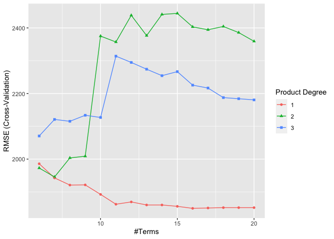<!-- -->

``` r
mars.fit$bestTune
```

    ##    nprune degree
    ## 11     16      1

``` r
#The best fitted model has 15 retained terms and 1 degree of interaction.
coef(mars.fit$finalModel)
```

    ##         (Intercept)     h(expend-14980)  h(room_board-4440)  h(4440-room_board) 
    ##       11104.8034361          -0.6941143           0.3591299          -1.1100088 
    ## h(f_undergrad-1405) h(1405-f_undergrad)   h(22-perc_alumni)        h(apps-3768) 
    ##          -0.3554965          -1.4530036         -87.1009741           0.3937132 
    ##    h(1300-personal)     h(grad_rate-98)     h(98-grad_rate)       h(903-enroll) 
    ##           1.0473195        -232.0382483         -21.6301024           4.8535163 
    ##      h(2342-accept)      h(expend-6889)          h(ph_d-95) 
    ##          -1.9204717           0.6995260         336.2819845

``` r
mars_pre=predict(mars.fit,newdata = college_data[-train_index,])
pdp::partial(mars.fit,pred.var=c("ph_d"),grid.resolution=10) %>% autoplot()
```

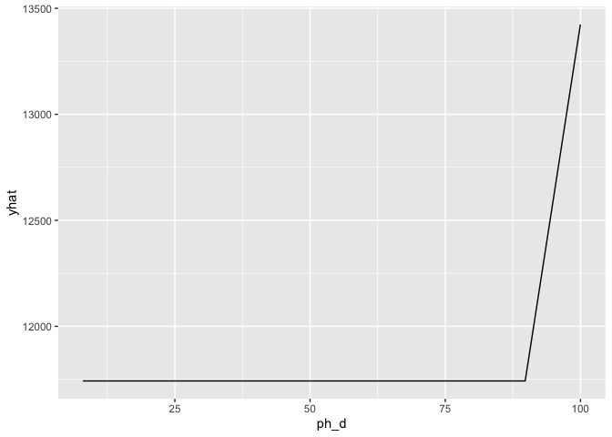<!-- -->

``` r
t_mse=mean((college_data[-train_index,]$outstate-mars_pre)**2)
t_mse
```

    ## [1] 1873834

``` r
#The test error MSE is 1873834.
```

``` r
#4.
set.seed(2023)
lm = train(x, y,
                  method = "lm",
                  trControl = ctrl1)
```

    ## Warning: Setting row names on a tibble is deprecated.
    ## Setting row names on a tibble is deprecated.
    ## Setting row names on a tibble is deprecated.
    ## Setting row names on a tibble is deprecated.
    ## Setting row names on a tibble is deprecated.
    ## Setting row names on a tibble is deprecated.
    ## Setting row names on a tibble is deprecated.
    ## Setting row names on a tibble is deprecated.
    ## Setting row names on a tibble is deprecated.
    ## Setting row names on a tibble is deprecated.
    ## Setting row names on a tibble is deprecated.

``` r
resamp = resamples(list(MARS = mars.fit,
                         LM = lm))
summary(resamp)
```

    ## 
    ## Call:
    ## summary.resamples(object = resamp)
    ## 
    ## Models: MARS, LM 
    ## Number of resamples: 10 
    ## 
    ## MAE 
    ##          Min.  1st Qu.   Median     Mean  3rd Qu.     Max. NA's
    ## MARS 1248.307 1378.088 1459.796 1465.162 1574.670 1683.588    0
    ## LM   1348.906 1484.800 1599.339 1596.672 1669.433 1892.398    0
    ## 
    ## RMSE 
    ##          Min.  1st Qu.   Median     Mean  3rd Qu.     Max. NA's
    ## MARS 1496.628 1710.463 1804.826 1849.867 1973.748 2193.717    0
    ## LM   1692.028 1847.557 2005.305 2009.887 2047.534 2622.211    0
    ## 
    ## Rsquared 
    ##           Min.   1st Qu.    Median      Mean   3rd Qu.      Max. NA's
    ## MARS 0.6651486 0.7206324 0.7714664 0.7544352 0.7941941 0.8252056    0
    ## LM   0.5284982 0.7097322 0.7294178 0.7130244 0.7446280 0.7883855    0

``` r
bwplot(resamp, metric = "RMSE")
```

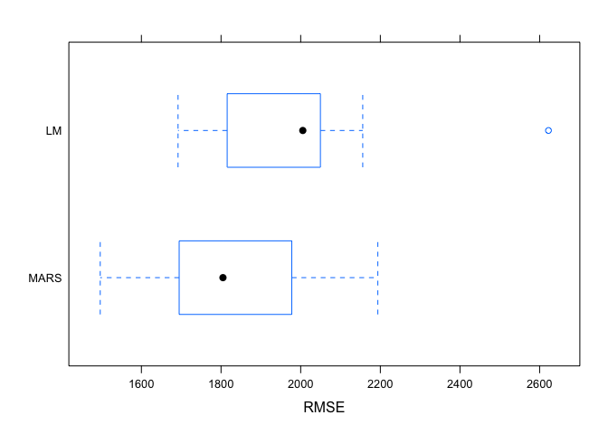<!-- -->

``` r
#As the plot shows, the MARS model has the smaller MSE, so we prefer the MARS model when predicting the out-of-state tuition. For general applications, MARS is a better approach compared to a linear model, because it has a smaller RMSE.
```
